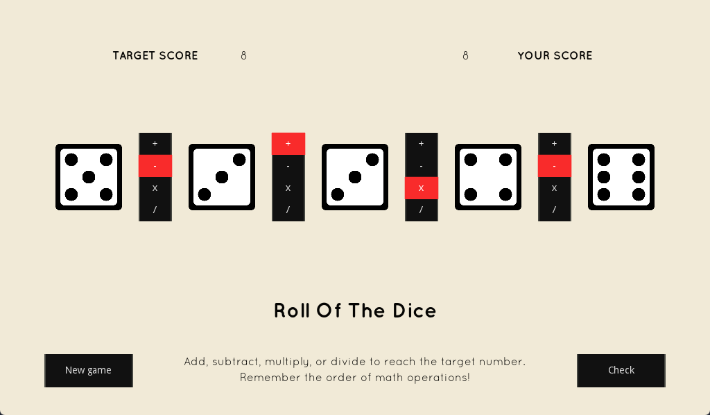

# GMTK Game Jam 2022
The GMTK Game Jam is an annual game making marathon, where individuals
and teams try to make a game that fits a theme, in just 48 hours.

The theme for the year 2022 was **Roll of the Dice**.

## Roll of the Dice
A simple math-based 2D puzzle game where a random number is generated
and you need to reach that number using math and 5 dice.

You can add, subtract, multiply and divide with no limit on repetitions.  Every
play has always a solution (sometimes more than one!), you just have to use the
right operators.

Keep in mind the order of operations in math: multiplication and division first,
then addition and subtraction.  Also, division is a floor/integer division,
only the quotient is preserved, so `4/3 = 1`.

Unpublished project for the GMTK Game Jam 2022.
Also, first game, first Godot project and first jam ever.

## Keyboard shortcuts
- Start new game: N
- Check player score: C
- Toggle first operator: 1
- Toggle second operator: 2
- Toggle third operator: 3
- Toggle fourth operator: 4

## Credits
The game was developed with the Godot Engine.
Font downloaded from fontsquirrel.com and SFX from freesound.org.
Sprites created during the jam.
